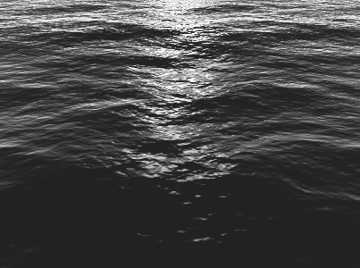

Ocean Simulation Using FFT on GPU for Unity
========
* FFT-base Wind-Driven Ocean [1]
* Cooley-Tukey FFT Algorithm [2]
* Scenes
 * Ocean : Reflection, Refraction, Absorption
 * DarkWater : Parallax, Lighting

# References
1. Tessendorf, J. (2001). Simulating ocean water. Simulating Nature: Realistic and Interactive …. Retrieved from https://evasion.imag.fr/Membres/Fabrice.Neyret/images/fluids-nuages/waves/Jonathan/articlesCG/simulating-ocean-water-01.pdf
2. Brandon, L. (2008). Fast computation of general Fourier transforms on GPUs. Multimedia and Expo, …. Retrieved from http://ieeexplore.ieee.org/xpls/abs_all.jsp?arnumber=4607357
